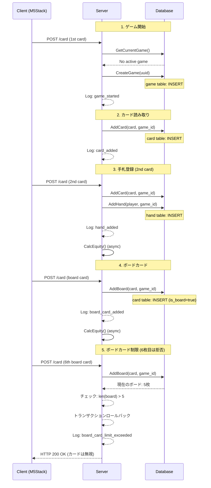

# Game Lifecycle

このドキュメントでは、RFID Pokerシステムにおけるゲームのライフサイクルについて説明します。

## 概要

RFID Pokerシステムでは、ゲームごとにUUIDを発行し、同じゲーム内のすべての操作を追跡できるようにしています。ゲームの状態は `game` テーブルで管理され、各カードや手札は `game_id` を持つことで、どのゲームに属するかが明確になります。

## ゲームのライフサイクル

```
[1. ゲーム開始]
    ↓
[2. カード読み取り]
    ↓
[3. プレイヤー手札の登録]
    ↓
[4. ボードカードの登録]
    ↓
[5. Equity計算]
    ↓
[6. ゲーム終了]
    ↓
[7. 次ゲームへ]
```

## 1. ゲーム開始

### トリガー
- 最初のカード読み取り時、アクティブなゲームが存在しない場合に自動的に新しいゲームが開始されます

### 処理内容

**関数**: `store.CreateNewGame()`

1. UUID生成
2. `game` テーブルに新しいレコードを挿入
   - `id`: 生成されたUUID
   - `status`: 'active'
   - `started_at`: 現在時刻（自動設定）

**ログ出力**:
```go
slog.InfoContext(ctx, "New game started",
    slog.String("game_id", gameID),
    slog.String("event", "game_started"))
```

**ログ例**:
```
INFO New game started game_id=a1b2c3d4-e5f6-7890-abcd-ef1234567890 event=game_started
```

### データベース状態

```sql
-- game テーブル
INSERT INTO game (id, status, started_at)
VALUES ('a1b2c3d4-e5f6-7890-abcd-ef1234567890', 'active', NOW());
```

## 2. カード読み取り

### トリガー
- M5StackデバイスがNFCカードを読み取り
- `/POST /card` エンドポイントが呼ばれる

### 処理内容

**関数**: `server.processCard()` → `store.AddCard()`

1. カードUIDから実際のカード（ランク・スート）にマッピング
2. 現在のゲームIDを取得または新規作成
3. `card` テーブルに挿入
   - アンテナタイプ（player/board/muck）によって処理が分岐

**ログ出力**:
```go
slog.InfoContext(ctx, "Added card",
    slog.String("game_id", gameID),
    slog.String("event", "card_added"),
    slog.String("card_rank", card.Rank.String()),
    slog.String("card_suit", card.Suit.String()),
    slog.String("serial", serial))
```

**ログ例**:
```
INFO Added card game_id=a1b2c3d4-... event=card_added card_rank=A card_suit=Spade serial=device123-0
```

### データベース状態

```sql
-- card テーブル
INSERT INTO card (card_suit, card_rank, serial, is_board, game_id)
VALUES ('Spade', 'A', 'device123-0', false, 'a1b2c3d4-...');
```

## 3. プレイヤー手札の登録

### トリガー
- 同じプレイヤーアンテナで2枚目のカードが読み取られた時

### 処理内容

**関数**: `store.AddHand()`

1. 2枚のカードをソート（ランク順）
2. `hand` テーブルに手札を登録
3. 各カードに `hand_id` を設定

**ログ出力**:
```go
// 手札登録時
slog.InfoContext(ctx, "Added hand for player",
    slog.String("game_id", gameID),
    slog.String("event", "hand_added"),
    slog.String("player_name", player.Name),
    slog.Int("player_id", int(player.ID)),
    slog.String("serial", serial))

// カード追加時（各カードごと）
slog.InfoContext(ctx, "Added card to player hand",
    slog.String("game_id", gameID),
    slog.String("event", "card_added"),
    slog.String("card_rank", c.Rank.String()),
    slog.String("card_suit", c.Suit.String()),
    slog.Bool("is_board", false),
    slog.String("serial", serial))
```

**ログ例**:
```
INFO Added hand for player game_id=a1b2c3d4-... event=hand_added player_name=player-device123 player_id=1 serial=device123-0
INFO Added card to player hand game_id=a1b2c3d4-... event=card_added card_rank=A card_suit=Spade is_board=false serial=device123-0
INFO Added card to player hand game_id=a1b2c3d4-... event=card_added card_rank=K card_suit=Heart is_board=false serial=device123-0
```

### データベース状態

```sql
-- hand テーブル
INSERT INTO hand (player_id, is_muck, game_id)
VALUES (1, false, 'a1b2c3d4-...');

-- card テーブル（hand_idを更新）
UPDATE card SET hand_id = 1 WHERE id IN (1, 2);
```

## 4. ボードカードの登録

### トリガー
- ボードアンテナでカードが読み取られた時

### 処理内容

**関数**: `store.AddBoard()`

1. 既存のボードカードを取得
2. 新しいカードを追加（重複チェック）
3. ボードカード数を確認（5枚を超える場合は拒否）

**ログ出力（成功時）**:
```go
slog.InfoContext(ctx, "Added board card",
    slog.String("game_id", gameID),
    slog.String("event", "board_card_added"),
    slog.String("card_rank", c.Rank.String()),
    slog.String("card_suit", c.Suit.String()),
    slog.Bool("is_board", true),
    slog.String("serial", serial),
    slog.Int("board_card_count", len(board)+1))
```

**ログ出力（制限超過時）**:
```go
slog.WarnContext(ctx, "Board card limit exceeded, rejecting request",
    slog.String("game_id", gameID),
    slog.String("event", "board_card_limit_exceeded"),
    slog.Int("current_board_count", len(nowBoard)),
    slog.Int("attempted_total", len(board)))
```

**ログ例**:
```
INFO Added board card game_id=a1b2c3d4-... event=board_card_added card_rank=Q card_suit=Diamond is_board=true serial=board-device board_card_count=3
INFO Added board card game_id=a1b2c3d4-... event=board_card_added card_rank=J card_suit=Club is_board=true serial=board-device board_card_count=4
INFO Added board card game_id=a1b2c3d4-... event=board_card_added card_rank=10 card_suit=Spade is_board=true serial=board-device board_card_count=5
WARN Board card limit exceeded, rejecting request game_id=a1b2c3d4-... event=board_card_limit_exceeded current_board_count=5 attempted_total=6
```

### データベース状態

```sql
-- card テーブル（ボードカード）
INSERT INTO card (card_suit, card_rank, serial, is_board, game_id)
VALUES ('Diamond', 'Q', 'board-device', true, 'a1b2c3d4-...');
```

### ボードカードの制限

テキサスホールデムでは最大5枚のボードカードを使用します：
- Flop: 3枚
- Turn: 4枚目
- River: 5枚目

**6枚目のカードを読み取った場合**:
- リクエストは拒否され、データベースに保存されません
- トランザクションはロールバックされます
- `board_card_limit_exceeded` イベントの警告ログが出力されます
- HTTP 200 OKが返されます（エラーではなく、単に無視されます）

## 5. Equity計算

### トリガー
- 手札が登録された時（2枚目のカードが読み取られた時）
- ボードカードが追加された時

### 処理内容

**関数**: `store.CalcEquity()`

1. 全プレイヤーの手札を取得（muckされていない）
2. 現在のボードカードを取得
3. poker-goライブラリを使用してEquity計算
4. 各手札のEquityを更新

**ログ出力**:
計算処理自体のログは既存のslog実装に依存します。

### データベース状態

```sql
-- hand テーブル（Equity更新）
UPDATE hand SET equity = 0.45 WHERE id = 1;
UPDATE hand SET equity = 0.35 WHERE id = 2;
UPDATE hand SET equity = 0.20 WHERE id = 3;
```

## 6. ゲーム終了

ゲームの終了には2つのパターンがあります。

### 6.1 管理者APIによる手動削除

**トリガー**: 管理者がゲーム削除エンドポイントを呼び出した時

**エンドポイント**: `DELETE /admin/game`

**関数**: `store.ClearGame()` → `store.FinishCurrentGame()`

1. 現在のゲームの `game_id` を取得
2. `game` テーブルの `ended_at` を更新し、`status` を 'finished' に変更
3. 全カードと手札を削除
4. アンテナタイムスタンプをリセット
5. WebSocketクライアントに通知

**レスポンス**: HTTP 204 No Content

### 6.2 タイムアウトによる終了

**トリガー**: 設定時間内にカードが読み取られなかった時

**関数**: `server.startGameTimeoutChecker()`

- 5秒ごとにチェック
- 全アンテナタイプがタイムアウト時間（`config.GameTimeoutSeconds`）を超えた場合
- `store.ClearGame()` を呼び出し

設定値が0以下の場合、タイムアウト機能は無効になります。

### データベース状態

```sql
-- game テーブル（終了時）
UPDATE game SET ended_at = NOW(), status = 'finished'
WHERE id = 'a1b2c3d4-...';

-- card と hand テーブル（削除）
DELETE FROM card;
DELETE FROM hand;
```

## 7. Muck操作

### トリガー
- Muckアンテナで2枚のカードが読み取られた時

### 処理内容

**関数**: `store.MuckPlayer()`

1. カードから対応する手札を特定
2. 手札の `is_muck` フラグを `true` に設定
3. Equity計算から除外される

**ログ出力**:
```go
// Muck開始
slog.InfoContext(ctx, "Muck player initiated",
    slog.String("game_id", gameID),
    slog.String("event", "muck_initiated"),
    slog.Int("card_count", len(cards)))

// Muck完了
slog.InfoContext(ctx, "Player hand mucked",
    slog.String("game_id", gameID),
    slog.String("event", "hand_mucked"),
    slog.Int("hand_id", int(hand.ID)),
    slog.Int("player_id", int(hand.PlayerID)))
```

**ログ例**:
```
INFO Muck player initiated game_id=a1b2c3d4-... event=muck_initiated card_count=2
INFO Player hand mucked game_id=a1b2c3d4-... event=hand_mucked hand_id=2 player_id=2
```

### データベース状態

```sql
-- hand テーブル（Muck設定）
UPDATE hand SET is_muck = true WHERE id = 2;
```

## データベーススキーマ

### game テーブル

| カラム名 | 型 | 説明 |
|---------|-----|------|
| id | VARCHAR(36) | ゲームのUUID（主キー） |
| started_at | TIMESTAMP | ゲーム開始時刻 |
| ended_at | TIMESTAMP | ゲーム終了時刻（NULLable） |
| status | VARCHAR(10) | ゲームの状態（'active' or 'finished'） |

### hand テーブル（game_id追加）

| カラム名 | 型 | 説明 |
|---------|-----|------|
| id | INT | 手札ID（主キー） |
| player_id | INT | プレイヤーID（外部キー） |
| equity | FLOAT | Equity値 |
| is_muck | BOOLEAN | Muckフラグ |
| **game_id** | **VARCHAR(36)** | **ゲームID（外部キー）** |

### card テーブル（game_id追加）

| カラム名 | 型 | 説明 |
|---------|-----|------|
| id | INT | カードID（主キー） |
| card_suit | VARCHAR(255) | スート |
| card_rank | VARCHAR(255) | ランク |
| is_board | BOOLEAN | ボードカードフラグ |
| hand_id | INT | 手札ID（外部キー、NULLable） |
| serial | VARCHAR(255) | アンテナシリアル（外部キー） |
| **game_id** | **VARCHAR(36)** | **ゲームID（外部キー）** |

## ログのイベント一覧

構造化ログで使用される `event` 属性の一覧：

| イベント名 | 説明 | 出力関数 |
|-----------|------|---------|
| `game_started` | 新しいゲームが開始 | `store.CreateNewGame()` |
| `game_finished` | ゲームが終了 | `store.FinishCurrentGame()` |
| `game_cleared` | ゲームデータがクリア | `server.HandleDeleteAdminGame()` |
| `card_added` | カードが追加 | `store.AddCard()`, `store.AddHand()` |
| `hand_added` | 手札が登録 | `store.AddHand()` |
| `board_card_added` | ボードカードが追加 | `store.AddBoard()` |
| `board_card_limit_exceeded` | ボードカード制限（5枚）超過 | `store.AddBoard()` |
| `muck_initiated` | Muck操作開始 | `store.MuckPlayer()` |
| `hand_mucked` | 手札がMuckされた | `store.MuckPlayer()` |

## ログの検索例

### 特定のゲームのすべてのログを取得
```bash
# JSON形式でログを出力している場合
cat server.log | jq 'select(.game_id == "a1b2c3d4-...")'
```

### 特定のイベントタイプでフィルタ
```bash
# hand_added イベントのみ
cat server.log | jq 'select(.event == "hand_added")'
```

### 特定のプレイヤーの操作を追跡
```bash
# player_id = 1 のログ
cat server.log | jq 'select(.player_id == 1)'
```

## ゲームフロー図



## まとめ

- 各ゲームはUUIDで一意に識別されます
- すべてのカードと手札は `game_id` を持ち、どのゲームに属するかが明確です
- 構造化ログにより、ゲームの流れを詳細に追跡できます
- ボードカードは最大5枚に制限されます（6枚目は拒否されます）
- ゲームは管理者APIによる手動削除またはタイムアウトにより終了します
- ログの `event` 属性を使用して、特定の操作だけをフィルタできます
