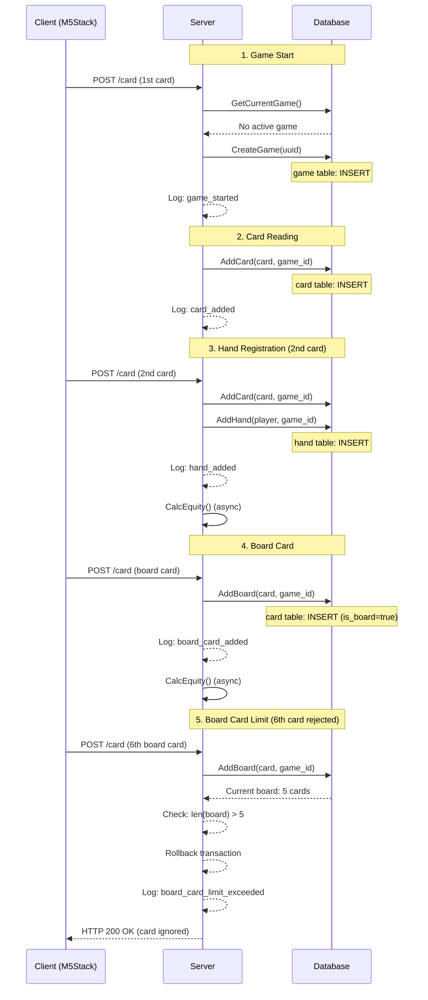

# Game Lifecycle

This document describes the game lifecycle in the RFID Poker system.

## Overview

The RFID Poker system generates a UUID for each game, enabling tracking of all operations within the same game. Game state is managed in the `game` table, and each card and hand has a `game_id` to clearly identify which game it belongs to.

## Game Lifecycle Flow

```
[1. Game Start]
    ↓
[2. Card Reading]
    ↓
[3. Player Hand Registration]
    ↓
[4. Board Card Registration]
    ↓
[5. Equity Calculation]
    ↓
[6. Game End]
    ↓
[7. Next Game]
```

## 1. Game Start

### Trigger
- A new game automatically starts when the first card is read and no active game exists

### Process

**Function**: `store.CreateNewGame()`

1. Generate UUID
2. Insert new record into `game` table
   - `id`: Generated UUID
   - `status`: 'active'
   - `started_at`: Current timestamp (auto-set)

**Log Output**:
```go
slog.InfoContext(ctx, "New game started",
    slog.String("game_id", gameID),
    slog.String("event", "game_started"))
```

**Log Example**:
```
INFO New game started game_id=a1b2c3d4-e5f6-7890-abcd-ef1234567890 event=game_started
```

### Database State

```sql
-- game table
INSERT INTO game (id, status, started_at)
VALUES ('a1b2c3d4-e5f6-7890-abcd-ef1234567890', 'active', NOW());
```

## 2. Card Reading

### Trigger
- M5Stack device reads an NFC card
- `/POST /card` endpoint is called

### Process

**Function**: `server.processCard()` → `store.AddCard()`

1. Map card UID to actual card (rank & suit)
2. Get or create current game ID
3. Insert into `card` table
   - Processing branches based on antenna type (player/board/muck)

**Log Output**:
```go
slog.InfoContext(ctx, "Added card",
    slog.String("game_id", gameID),
    slog.String("event", "card_added"),
    slog.String("card_rank", card.Rank.String()),
    slog.String("card_suit", card.Suit.String()),
    slog.String("serial", serial))
```

**Log Example**:
```
INFO Added card game_id=a1b2c3d4-... event=card_added card_rank=A card_suit=Spade serial=device123-0
```

### Database State

```sql
-- card table
INSERT INTO card (card_suit, card_rank, serial, is_board, game_id)
VALUES ('Spade', 'A', 'device123-0', false, 'a1b2c3d4-...');
```

## 3. Player Hand Registration

### Trigger
- When the second card is read by the same player antenna

### Process

**Function**: `store.AddHand()`

1. Sort two cards (by rank)
2. Register hand in `hand` table
3. Set `hand_id` for each card

**Log Output**:
```go
// Hand registration
slog.InfoContext(ctx, "Added hand for player",
    slog.String("game_id", gameID),
    slog.String("event", "hand_added"),
    slog.String("player_name", player.Name),
    slog.Int("player_id", int(player.ID)),
    slog.String("serial", serial))

// Card addition (for each card)
slog.InfoContext(ctx, "Added card to player hand",
    slog.String("game_id", gameID),
    slog.String("event", "card_added"),
    slog.String("card_rank", c.Rank.String()),
    slog.String("card_suit", c.Suit.String()),
    slog.Bool("is_board", false),
    slog.String("serial", serial))
```

**Log Example**:
```
INFO Added hand for player game_id=a1b2c3d4-... event=hand_added player_name=player-device123 player_id=1 serial=device123-0
INFO Added card to player hand game_id=a1b2c3d4-... event=card_added card_rank=A card_suit=Spade is_board=false serial=device123-0
INFO Added card to player hand game_id=a1b2c3d4-... event=card_added card_rank=K card_suit=Heart is_board=false serial=device123-0
```

### Database State

```sql
-- hand table
INSERT INTO hand (player_id, is_muck, game_id)
VALUES (1, false, 'a1b2c3d4-...');

-- card table (update hand_id)
UPDATE card SET hand_id = 1 WHERE id IN (1, 2);
```

## 4. Board Card Registration

### Trigger
- When a card is read by a board antenna

### Process

**Function**: `store.AddBoard()`

1. Get existing board cards
2. Add new card (with duplicate check)
3. Check board card count (reject if exceeds 5 cards)

**Log Output (Success)**:
```go
slog.InfoContext(ctx, "Added board card",
    slog.String("game_id", gameID),
    slog.String("event", "board_card_added"),
    slog.String("card_rank", c.Rank.String()),
    slog.String("card_suit", c.Suit.String()),
    slog.Bool("is_board", true),
    slog.String("serial", serial),
    slog.Int("board_card_count", len(board)+1))
```

**Log Output (Limit Exceeded)**:
```go
slog.WarnContext(ctx, "Board card limit exceeded, rejecting request",
    slog.String("game_id", gameID),
    slog.String("event", "board_card_limit_exceeded"),
    slog.Int("current_board_count", len(nowBoard)),
    slog.Int("attempted_total", len(board)))
```

**Log Example**:
```
INFO Added board card game_id=a1b2c3d4-... event=board_card_added card_rank=Q card_suit=Diamond is_board=true serial=board-device board_card_count=3
INFO Added board card game_id=a1b2c3d4-... event=board_card_added card_rank=J card_suit=Club is_board=true serial=board-device board_card_count=4
INFO Added board card game_id=a1b2c3d4-... event=board_card_added card_rank=10 card_suit=Spade is_board=true serial=board-device board_card_count=5
WARN Board card limit exceeded, rejecting request game_id=a1b2c3d4-... event=board_card_limit_exceeded current_board_count=5 attempted_total=6
```

### Database State

```sql
-- card table (board cards)
INSERT INTO card (card_suit, card_rank, serial, is_board, game_id)
VALUES ('Diamond', 'Q', 'board-device', true, 'a1b2c3d4-...');
```

### Board Card Limits

Texas Hold'em uses a maximum of 5 board cards:
- Flop: 3 cards
- Turn: 4th card
- River: 5th card

**When the 6th card is read**:
- The request is rejected without saving to the database
- Transaction is rolled back
- Warning log is output with `board_card_limit_exceeded` event
- HTTP 200 OK is returned (not an error, just ignored)

## 5. Equity Calculation

### Trigger
- When a hand is registered (when the second card is read)
- When a board card is added

### Process

**Function**: `store.CalcEquity()`

1. Get all player hands (not mucked)
2. Get current board cards
3. Calculate equity using poker-go library
4. Update equity for each hand

**Log Output**:
The calculation process itself relies on existing slog implementation.

### Database State

```sql
-- hand table (equity update)
UPDATE hand SET equity = 0.45 WHERE id = 1;
UPDATE hand SET equity = 0.35 WHERE id = 2;
UPDATE hand SET equity = 0.20 WHERE id = 3;
```

## 6. Game End

There are two patterns for game ending.

### 6.1 Manual Deletion via Admin API

**Trigger**: When admin calls the delete game endpoint

**Endpoint**: `DELETE /admin/game`

**Function**: `store.ClearGame()` → `store.FinishCurrentGame()`

1. Get current game's `game_id`
2. Update `ended_at` in `game` table and change `status` to 'finished'
3. Delete all cards and hands
4. Reset antenna timestamps
5. Notify WebSocket clients

**Response**: HTTP 204 No Content

### 6.2 End by Timeout

**Trigger**: When no card is read within the configured time

**Function**: `server.startGameTimeoutChecker()`

- Checks every 5 seconds
- When all antenna types exceed timeout duration (`config.GameTimeoutSeconds`)
- Calls `store.ClearGame()`

If the configured value is 0 or less, timeout functionality is disabled.

### Database State

```sql
-- game table (on finish)
UPDATE game SET ended_at = NOW(), status = 'finished'
WHERE id = 'a1b2c3d4-...';

-- card and hand tables (deletion)
DELETE FROM card;
DELETE FROM hand;
```

## 7. Muck Operation

### Trigger
- When two cards are read by a muck antenna

### Process

**Function**: `store.MuckPlayer()`

1. Identify the corresponding hand from the cards
2. Set hand's `is_muck` flag to `true`
3. Excluded from equity calculation

**Log Output**:
```go
// Muck initiated
slog.InfoContext(ctx, "Muck player initiated",
    slog.String("game_id", gameID),
    slog.String("event", "muck_initiated"),
    slog.Int("card_count", len(cards)))

// Muck completed
slog.InfoContext(ctx, "Player hand mucked",
    slog.String("game_id", gameID),
    slog.String("event", "hand_mucked"),
    slog.Int("hand_id", int(hand.ID)),
    slog.Int("player_id", int(hand.PlayerID)))
```

**Log Example**:
```
INFO Muck player initiated game_id=a1b2c3d4-... event=muck_initiated card_count=2
INFO Player hand mucked game_id=a1b2c3d4-... event=hand_mucked hand_id=2 player_id=2
```

### Database State

```sql
-- hand table (set muck)
UPDATE hand SET is_muck = true WHERE id = 2;
```

## Database Schema

### game table

| Column | Type | Description |
|--------|------|-------------|
| id | VARCHAR(36) | Game UUID (primary key) |
| started_at | TIMESTAMP | Game start time |
| ended_at | TIMESTAMP | Game end time (nullable) |
| status | VARCHAR(10) | Game status ('active' or 'finished') |

### hand table (with game_id)

| Column | Type | Description |
|--------|------|-------------|
| id | INT | Hand ID (primary key) |
| player_id | INT | Player ID (foreign key) |
| equity | FLOAT | Equity value |
| is_muck | BOOLEAN | Muck flag |
| **game_id** | **VARCHAR(36)** | **Game ID (foreign key)** |

### card table (with game_id)

| Column | Type | Description |
|--------|------|-------------|
| id | INT | Card ID (primary key) |
| card_suit | VARCHAR(255) | Suit |
| card_rank | VARCHAR(255) | Rank |
| is_board | BOOLEAN | Board card flag |
| hand_id | INT | Hand ID (foreign key, nullable) |
| serial | VARCHAR(255) | Antenna serial (foreign key) |
| **game_id** | **VARCHAR(36)** | **Game ID (foreign key)** |

## Event List

List of `event` attributes used in structured logs:

| Event Name | Description | Function |
|-----------|-------------|----------|
| `game_started` | New game started | `store.CreateNewGame()` |
| `game_finished` | Game finished | `store.FinishCurrentGame()` |
| `game_cleared` | Game data cleared | `server.HandleDeleteAdminGame()` |
| `card_added` | Card added | `store.AddCard()`, `store.AddHand()` |
| `hand_added` | Hand registered | `store.AddHand()` |
| `board_card_added` | Board card added | `store.AddBoard()` |
| `board_card_limit_exceeded` | Board card limit (5 cards) exceeded | `store.AddBoard()` |
| `muck_initiated` | Muck operation started | `store.MuckPlayer()` |
| `hand_mucked` | Hand mucked | `store.MuckPlayer()` |

## Log Search Examples

### Get all logs for a specific game
```bash
# When logs are output in JSON format
cat server.log | jq 'select(.game_id == "a1b2c3d4-...")'
```

### Filter by specific event type
```bash
# Only hand_added events
cat server.log | jq 'select(.event == "hand_added")'
```

### Track specific player operations
```bash
# Logs for player_id = 1
cat server.log | jq 'select(.player_id == 1)'
```

## Game Flow Diagram



## Summary

- Each game is uniquely identified by a UUID
- All cards and hands have a `game_id` to clearly identify which game they belong to
- Structured logging enables detailed tracking of game flow
- Board cards are limited to a maximum of 5 cards (6th card is rejected)
- Games end through manual deletion (admin API) or timeout
- The `event` attribute in logs can be used to filter specific operations
