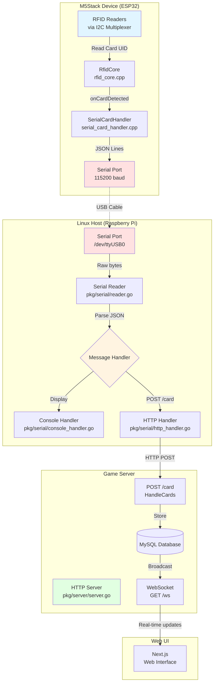
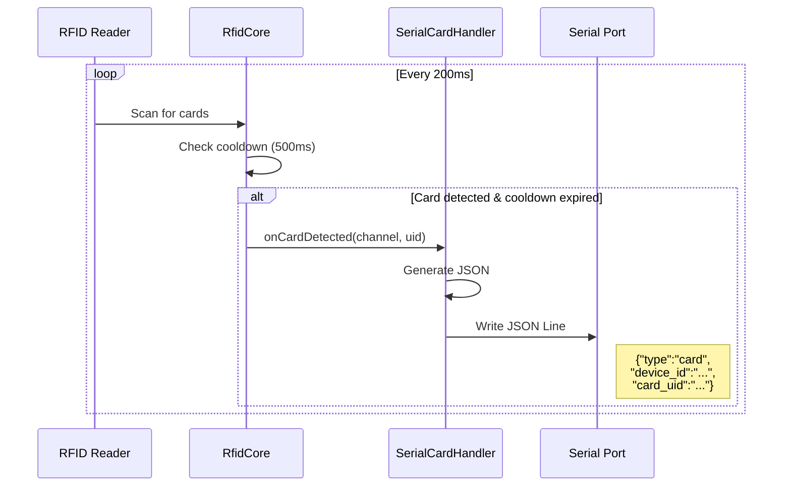
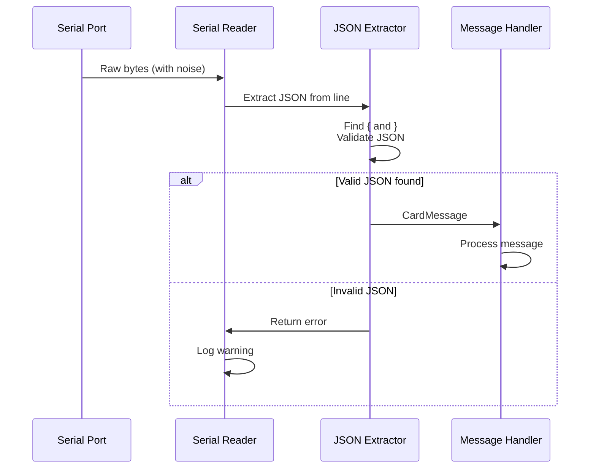
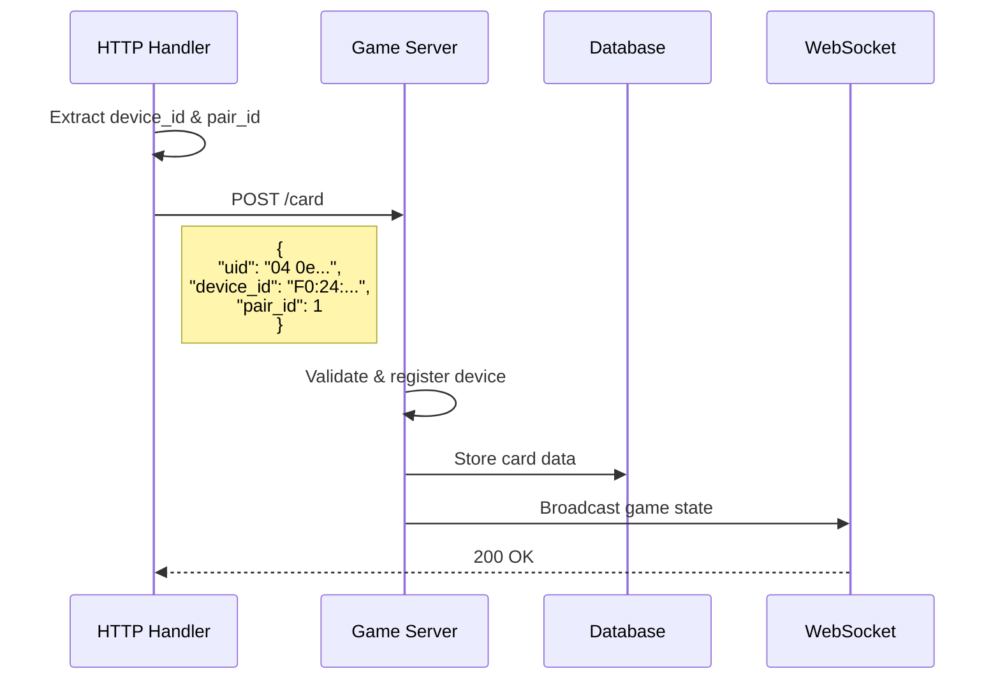

# Wired Client Architecture

This document describes the architecture of the M5Stack Wired Client and the Go application that reads from it.

## Overview

The Wired Client system is a 3-tier architecture where M5Stack devices read RFID cards, send data to a Linux host (e.g., Raspberry Pi) via serial communication, and forward that data to a game server via HTTP.

## System Architecture



## Data Flow

### 1. Card Detection (M5Stack)



### 2. Serial Communication (Linux Host)



### 3. HTTP Transmission (Optional)



## Component Details

### M5Stack Firmware (C++)

#### `clients/m5stack-wired/src/main.cpp`
- M5Stack device initialization
- Serial port configuration (115200 baud)
- RfidCore update loop (200ms interval)

#### `clients/lib/rfid-poker-common/src/rfid_core.cpp`
- RFID reader management (via I2C multiplexer)
- Card detection cooldown control
  - Wired Client: **500ms** (with `WIRED_CLIENT` flag)
  - WiFi Client: **10000ms** (default)
- Client type-specific behavior (PLAYER/BOARD/MUCK)

#### `clients/m5stack-wired/src/serial_card_handler.cpp`
- JSON Lines format serial output
- Message types: `boot`, `card`, `error`
- Timestamp and sequence number generation

### Go Application (Linux Host)

#### `cmd/wired-client/main.go`
- Command-line argument processing
- Handler selection (Console or HTTP)
- Parallel serial port reading

**Command-line options:**
```bash
-port string           # Serial port pattern (glob supported)
-baud int             # Baud rate (default: 115200)
-list                 # List available ports
-no-http-send         # Disable HTTP transmission
-server string        # Server URL (default: http://localhost:8080)
```

#### `pkg/serial/reader.go`
- Serial port reading
- Multiple port support via glob patterns
- Parallel reading with goroutines
- Context support (cancellable)

#### `pkg/serial/handler.go`
- JSON extraction and validation
- Parsing with `goccy/go-json`
- Noise removal (skip binary data)

#### `pkg/serial/types.go`
- Message type definitions
- `BootMessage`, `CardMessage`, `ErrorMessage`

#### `pkg/serial/console_handler.go`
- Console output handler
- Emoji and colored display
- Structured logging

#### `pkg/serial/http_handler.go`
- HTTP POST handler
- Send to `POST /card` endpoint
- Extract `pair_id` from `device_id`
- Timeout and retry handling

### Game Server

#### `pkg/server/server.go`
- Echo framework-based HTTP server
- Real-time delivery via WebSocket
- MySQL database integration

#### `pkg/server/server_http_card.go`
- `POST /card` endpoint handler
- Automatic device registration
- Card ID mapping
- Game state calculation and broadcasting

## Message Format

### JSON Lines (Serial Communication)

#### Boot Message
```json
{
  "type": "boot",
  "ts": "T+0",
  "device_id": "F0:24:F9:BA:E2:54",
  "seq": 1,
  "fw_version": "1.0.0",
  "reason": "power_on"
}
```

#### Card Message
```json
{
  "type": "card",
  "ts": "T+149450",
  "device_id": "F0:24:F9:BA:E2:54",
  "seq": 2,
  "card_uid": "04 0e 3b d2 28 6b 85",
  "tech": "MIFARE",
  "rssi": 0
}
```

#### Error Message
```json
{
  "type": "error",
  "ts": "T+1000",
  "device_id": "F0:24:F9:BA:E2:54",
  "seq": 3,
  "code": "rfid_init_failed",
  "message": "Failed to initialize RFID reader on channel 0"
}
```

### HTTP POST (Server Communication)

```json
{
  "uid": "04 0e 3b d2 28 6b 85",
  "device_id": "F0:24:F9:BA:E2:54",
  "pair_id": 1
}
```

## Configuration and Build Flags

### M5Stack Build Flags

`clients/m5stack-wired/platformio.ini`:
```ini
build_flags =
  -DM5STACK_ATOM              # Hardware type
  -DWIRED_CLIENT              # Wired mode (500ms cooldown)
  -DCLIENT_TYPE=${sysenv.CLIENT_TYPE}  # player/board/muck
  -DDEVICE_ID=${sysenv.DEVICE_ID}      # Device ID (optional)
```

### Environment Variables

```bash
# M5Stack
export CLIENT_TYPE=player    # or board, muck
export DEVICE_ID=device1     # Optional: defaults to MAC address

# Go Server
export RFID_POKER_CONFIG_PATH=./config.yaml
export RFID_POKER_MYSQL_HOST=localhost
export RFID_POKER_MYSQL_PORT=3306
export RFID_POKER_MYSQL_USER=root
export RFID_POKER_MYSQL_PASSWORD=password
export RFID_POKER_MYSQL_DATABASE=rfid_poker
```

## Usage Examples

### 1. Console Output Only (Debug)

```bash
./bin/wired-client -port /dev/ttyUSB0 -no-http-send
```

### 2. HTTP POST to Server (Production)

```bash
# Local server
./bin/wired-client -port /dev/ttyUSB0

# Remote server
./bin/wired-client -port /dev/ttyUSB0 -server http://192.168.1.100:8080
```

### 3. Parallel Reading from Multiple Devices

```bash
# Glob pattern for multiple ports
./bin/wired-client -port "/dev/ttyUSB*" -server http://192.168.1.100:8080
```

## Troubleshooting

### Serial Communication Noise

**Symptom:**
```
{"time":"...","level":"WARN","msg":"Failed to handle message","error":"no valid JSON found"}
```

**Cause:**
Debug output or binary data from M5Stack boot mixed into JSON lines

**Solution:**
- `extractJSON` function in `pkg/serial/handler.go` removes noise
- Searches for first `{` and last `}`
- Validates with `goccy/go-json`

### Cards Detected Too Frequently

**Symptom:**
Same card sent multiple times

**Solution:**
- Controlled by `CARD_SEND_COOLDOWN_MS`
- Wired Client: 500ms
- WiFi Client: 10000ms

### HTTP POST Failures

**Symptom:**
```
❌ Failed to send to server: connection refused
```

**Solution:**
1. Verify server is running
2. Check URL with `-server` flag
3. Check firewall settings

## Performance

- **Card detection speed**: Scans every 200ms
- **Send cooldown**: 500ms (prevents duplicate sends of same card)
- **Serial communication**: 115200 baud
- **HTTP timeout**: 5 seconds
- **Parallel processing**: Multiple serial ports read in parallel

## Security Considerations

- Serial port access requires permissions (usually `dialout` group)
- HTTP communication is plaintext (HTTPS upgrade recommended)
- No device authentication (assumes trusted network)

## Future Improvements

- [ ] HTTPS support
- [ ] Device authentication
- [ ] Improved reconnection logic
- [ ] Metrics collection (Prometheus)
- [ ] Configuration file support (YAML/TOML)
